# UbiPanTriage

> **Quick exploration?** Use the online web server at **<http://129.211.3.138/>** for
> point-and-click analysis with default settings.
>
> **Full autonomy?** This R package is the comprehensive, user-controlled version:
> choose scoring methods, adjust dimension and sub-item weights, filter cancer
> types, download the pre-computed TCGA pan-cancer data (~4.2 GB), and run every
> analysis locally and reproducibly.

[](LICENSE)
[](https://www.r-project.org/)
[](https://shiny.posit.co/)

---

## Abstract

UbiPanTriage is an R package that implements a pan-cancer, four-dimensional
*triage* scoring framework for **ubiquitination-related gene sets** — or any
user-defined gene set — across **33 TCGA cancer types**. For every gene, the
package computes four complementary scores:

- **Ubiquitin** — functional-tier annotation (E1 / E2 / E3 ligases,
  deubiquitinating enzymes DUB, ubiquitin-binding domains UBD, ubiquitin-like
  domains ULD, and related genes);
- **Basic** — expression level, differential expression (tumor vs. normal),
  univariate Cox survival, and diagnostic/survival ROC evidence;
- **Immune** — weighted |Spearman r| against immune infiltration estimates
  (TIMER / CIBERSORT / MCPcounter / ssGSEA / xCell);
- **Metabolic** — weighted |Spearman r| against seven GSVA metabolic pathway
  scores (amino-acid, carbohydrate, lipid, energy, nucleotide, TCA, vitamin).

All weights — dimension weights, basic sub-items, immune cell types, metabolic
pathways — are user-adjustable, and the cross-cancer aggregation supports both
equal-weight averaging (default) and sample-size weighting. Scores are
returned as continuous 0–1 values together with within-cancer and pan-cancer
ranks, and can be visualized with a full gallery of publication-ready plots or
explored interactively through a built-in Shiny interface (English by default,
with a one-click simplified-Chinese toggle).

> The package complements the lightweight web server at
> <http://129.211.3.138/>. The web portal is designed for quick checks with
> default parameters; the R package additionally provides method selection,
> fine-grained weight tuning, custom data input, downloadable pre-computed
> data, and fully scriptable, reproducible analyses.

---

## Key features

- **Four-dimensional scoring with full parameter control** — dimension weights
  (0.1–1.0, one decimal place, summing to 1), relative weights of basic
  sub-items / immune cell types / metabolic pathways, immune deconvolution
  method (TIMER / CIBERSORT / MCPcounter / ssGSEA / xCell), and pan-cancer
  aggregation strategy (equal-weight vs. sample-size weighted).
- **Instant local analysis** — all 33 cancer caches store whole-genome
  expression (count / TPM / FPKM) and pre-computed sub-scores, so queries do
  not re-run Cox / ROC / correlation analyses.
- **Interactive Shiny interface (5 tabs)** — ① gene-set ranking across
  cancers; ② single-gene query (radar, immune/metabolic correlation heatmaps,
  expression comparison, tumor–normal boxplot, diagnostic ROC, KM survival,
  UpSet, automatic bilingual inference); ③ custom gene-set upload
  (.txt / .csv / .tsv / .xlsx, optional feature scores 0–1); ④ custom
  single-gene query; ⑤ methods & FAQ.
- **Graceful handling of missing data** — cancers without normal tissue /
  differential data (ACC, DLBC, LAML, LGG, MESO, OV, TGCT, UCS, UVM) are
  re-normalized over available sub-items and flagged with `*`; LAML immune
  scores fall back to CIBERSORT.
- **On-demand data download** — the source repository stays lightweight
  (~200 MB); the ~4.2 GB pre-computed pan-cancer caches are installed with a
  single command, `download_extdata()`, from the `data` branch as chunked,
  MD5-verified archives.

---

## Installation

Requirements: **R ≥ 4.1.0**.

```r
install.packages("remotes")
remotes::install_github("WangYY-666/UbiPanTriage-R", upgrade = "never")

# alternatively
# devtools::install_github("WangYY-666/UbiPanTriage-R", upgrade = "never")
```

### Step 1 — download the pre-computed data (once, ~4.2 GB)

```r
library(UbiPanTriage)
check_extdata()      # is the data ready?
download_extdata()   # download, MD5-verify, concatenate and install chunks
check_extdata()      # should report 33 cancers ready
```

> Chunks are downloaded from the `data` branch of the repository. Downloads
> are resumable (each chunk is verified individually) and re-running
> `download_extdata()` automatically skips completed chunks. If the package is
> installed in a system library without write permission, reinstall into a
> user library or pass a writable directory to `download_extdata(dest_dir = ...)`.
>
> **Network trouble?** The chunks are served from `raw.githubusercontent.com`,
> which can be slow or unreachable in mainland China. If the download fails
> with a `404`/DNS error or timeout, `download_extdata()` now automatically
> retries through mirror proxies (gh-proxy / ghproxy.net / mirror.ghproxy).
> You can also force a mirror, e.g.
> `download_extdata(mirror = "https://gh-proxy.com/https://raw.githubusercontent.com/WangYY-666/UbiPanTriage-R/data")`,
> retry later / use a proxy, or download the data once on an accessible
> machine and install offline with `download_extdata(local_dir = "...")`
> (see FAQ Q3).
>
> **Offline / local install.** If you already have a complete `extdata` folder
> (e.g. a copy from another computer or from `data-raw/`), skip the download:
>
> ```r
> download_extdata(local_dir = "path/to/your/extdata")   # copy instead of download
> ```

### Step 2 — launch the interactive app (optional)

```r
run_shiny_app()      # opens the browser; falls back to a random port if busy
```

---

## Quick start

```r
library(UbiPanTriage)

# 33 TCGA cancer types
available_cancers()

# load the pre-computed cache for one cancer
luad <- load_cancer_data("LUAD")

# single-cancer scoring of an arbitrary gene set
genes <- c("MUL1", "MDM2", "TRIM44", "UBE2C", "FBXW7")
res   <- score_genes(luad, genes)
head(res$scores[, c("Gene", "Ubi_Type", "Ubi_Score", "Basic_Score",
                    "Immune_Score", "Metabolic_Score",
                    "Combined_Score", "Combined_Rank")])

# tune parameters: heavier survival weight, switch immune method,
# sample-size-weighted pan-cancer aggregation
bp <- default_basic_params()
bp$weights <- c(expression = 1, diff = 1, survive = 2, roc = 1)
ip <- default_immune_params()
ip$method  <- "cibersort"
cp <- default_combine_params()
cp$method  <- "weighted"
res2 <- score_genes(luad, c("MUL1", "MDM2"),
                    basic_params = bp, immune_params = ip, combine_params = cp)

# pan-cancer scoring and ranking
caches     <- lapply(c("LUAD", "BRCA", "LIHC"), load_cancer_data)
res_multi  <- score_genes_multi(setNames(caches, c("LUAD", "BRCA", "LIHC")), genes)
head(res_multi$summary)     # per-gene pan-cancer summary with Pan_Rank
```

---

## Examples & figures

All figures below were generated with the current package version and are
identical to the corresponding Shiny outputs (tab ① gene-set ranking; tab ②
single-gene query). The complete, reproducible script is
[`data-raw/make_readme_figures.R`](data-raw/make_readme_figures.R).

### Example 1 — ubiquitination-related gene set (pan-cancer ranking)

A representative ubiquitination-related gene set covering all functional tiers:
E3 ligases (`MUL1`, `MDM2`, `NEDD4`, `FBXW7`), an E2 conjugating enzyme
(`UBE2C`), deubiquitinating enzymes (`TRIM44`, `USP7`, `USP14`), and a
ubiquitin precursor (`UBB`), scored across five cancer types
(LUAD / BRCA / LIHC / COAD / KIRC).

```r
cancers <- c("LUAD", "BRCA", "LIHC", "COAD", "KIRC")
caches  <- setNames(lapply(cancers, load_cancer_data), cancers)

genes <- c("MUL1", "MDM2", "TRIM44", "NEDD4", "UBE2C",
           "FBXW7", "USP7", "USP14", "UBB")
ann    <- annotate_genes(load_cancer_data("LUAD"), genes)   # ubiquitin tier
res    <- score_genes_multi(caches, genes)
summ   <- merge(res$summary, ann[, c("gene", "ubi_type_full")],
                by.x = "Gene", by.y = "gene")
long   <- res$scores_long

# 3D bubble: Immune (x) x Metabolic (y) x Basic (size), colored by Ubi tier
plot_3d_bubble(summ, type_col = "ubi_type_full")
```

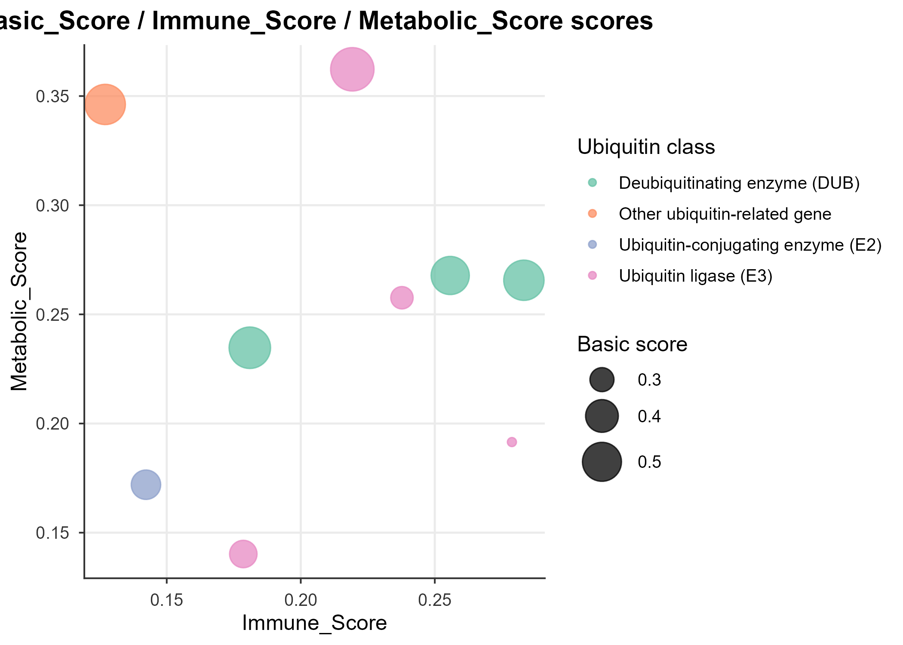

```r
# Faceted heatmap: Basic / Immune / Metabolic scores across 5 cancers
dims3 <- c(Basic = "Basic_Score", Immune = "Immune_Score", Metabolic = "Metabolic_Score")
facet <- do.call(rbind, lapply(names(dims3), function(nm)
  data.frame(Gene = long$Gene, Cancer = long$Cancer, Dim = nm,
             Score = long[[dims3[[nm]]]], stringsAsFactors = FALSE)))
plot_facet_heatmap(facet)
```

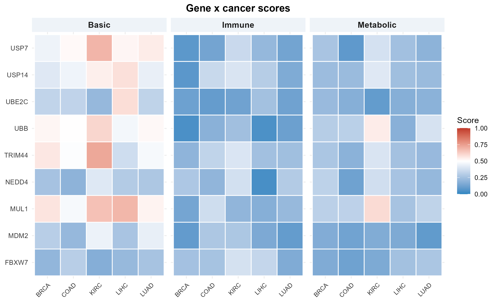

```r
# Pan-cancer ranking of the combined score
plot_ranking_grid(summ, top_n = nrow(summ))
```

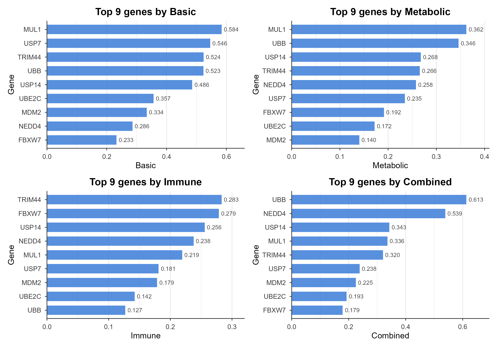

```r
# Four-dimension dot plot (gene x dimension)
d4 <- do.call(rbind, lapply(names(dims3), function(nm)
  data.frame(Gene = long$Gene, Dim = nm, Score = long[[dims3[[nm]]]],
             Combined = long$Combined_Score, stringsAsFactors = FALSE)))
plot_4d_dot(d4)
```

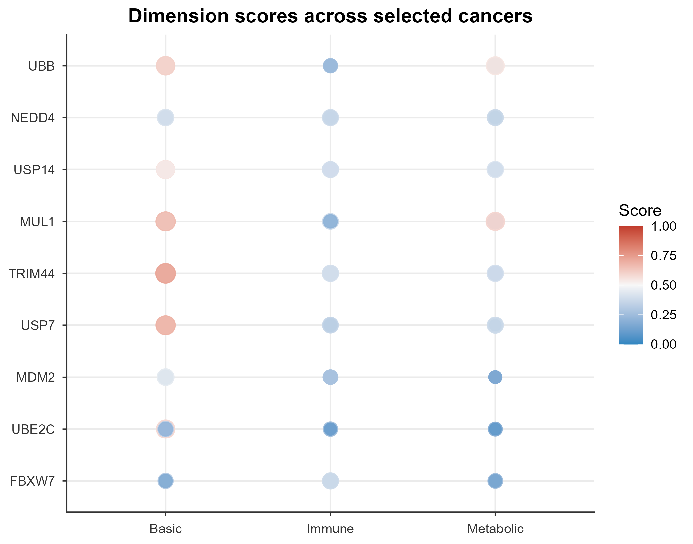

Pan-cancer summary for the example gene set (full table:
[`man/figures/example_summary.csv`](man/figures/example_summary.csv)):

| Gene | Ubiquitin annotation | Ubi | Basic | Immune | Metabolic | Combined | Pan_Rank |
| --- | --- | ---: | ---: | ---: | ---: | ---: | ---: |
| UBB | Other ubiquitin-related gene | 0.600 | 0.523 | 0.127 | 0.346 | 0.613 | 1 |
| NEDD4 | Ubiquitin ligase (E3) | 1.000 | 0.286 | 0.238 | 0.258 | 0.539 | 2 |
| USP14 | Deubiquitinating enzyme (DUB) | 0.900 | 0.486 | 0.256 | 0.268 | 0.343 | 3 |
| MUL1 | Ubiquitin ligase (E3) | 1.000 | 0.584 | 0.219 | 0.362 | 0.336 | 4 |
| TRIM44 | Deubiquitinating enzyme (DUB) | 0.900 | 0.524 | 0.283 | 0.266 | 0.320 | 5 |
| USP7 | Deubiquitinating enzyme (DUB) | 0.900 | 0.546 | 0.181 | 0.235 | 0.238 | 6 |
| MDM2 | Ubiquitin ligase (E3) | 1.000 | 0.334 | 0.179 | 0.140 | 0.225 | 7 |
| UBE2C | Ubiquitin-conjugating enzyme (E2) | 0.800 | 0.357 | 0.142 | 0.172 | 0.193 | 8 |
| FBXW7 | Ubiquitin ligase (E3) | 1.000 | 0.233 | 0.279 | 0.192 | 0.179 | 9 |

### Example 2 — single ubiquitination gene `MUL1` (multi-plot query)

`MUL1` (mitochondrial E3 ubiquitin ligase) illustrates the single-gene query
pipeline, which is equivalent to Shiny tab ②.

```r
luad  <- load_cancer_data("LUAD")
g     <- "MUL1"

# 1) four-dimension radar (pan-cancer mean of the four scores)
vals <- c(Ubiquitin = mean(long$Ubi_Score[long$Gene == g], na.rm = TRUE),
          Basic     = mean(long$Basic_Score[long$Gene == g], na.rm = TRUE),
          Immune    = mean(long$Immune_Score[long$Gene == g], na.rm = TRUE),
          Metabolic = mean(long$Metabolic_Score[long$Gene == g], na.rm = TRUE))
plot_radar_fmsb(vals, gene = g)
```

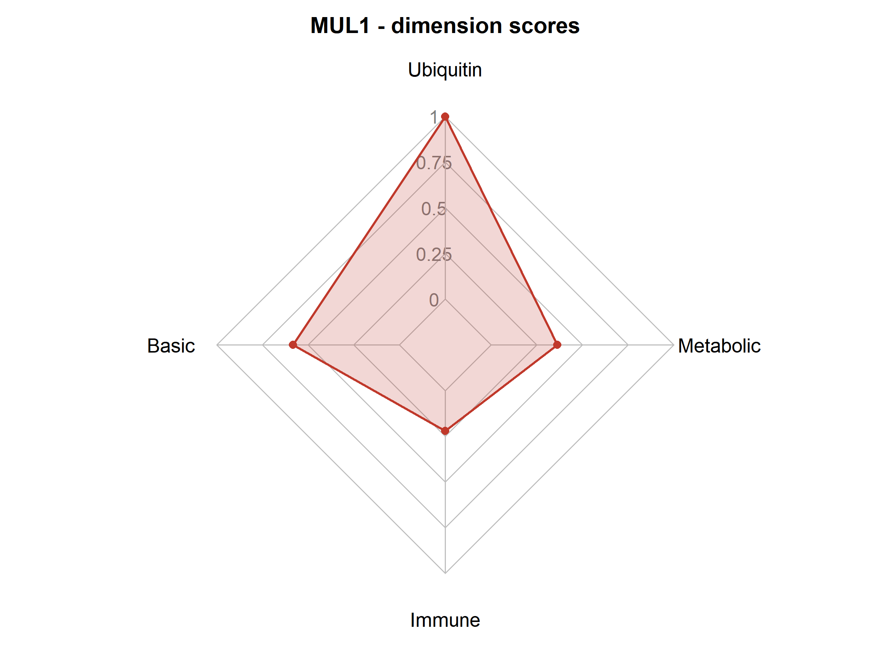

```r
# 2) immune infiltration correlation heatmap (TIMER, 5 cancers)
plot_cor_heatmap(imm, title = paste0(g, " - immune infiltration correlation (TIMER)"))
```

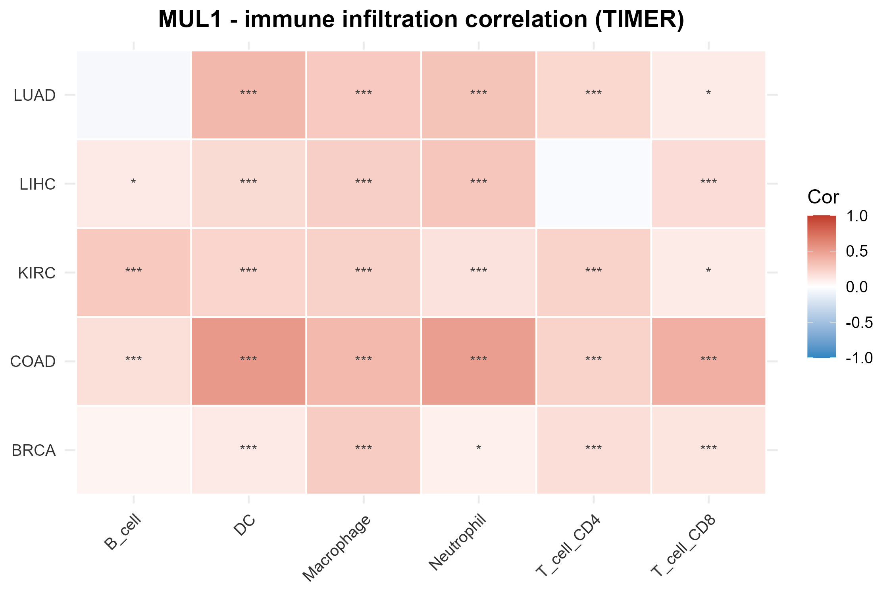

```r
# 3) metabolic pathway correlation heatmap (7 GSVA pathways)
plot_cor_heatmap(meta, title = paste0(g, " - metabolic pathway correlation"))
```

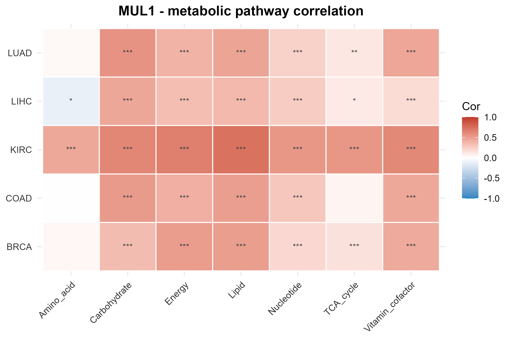

```r
# 4) pan-cancer expression (TPM, tumor vs. normal)
plot_expr_pancancer(caches, g, "tpm", show_normal = TRUE)
```

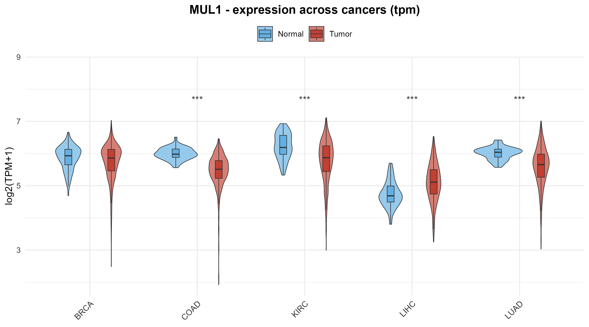

```r
# 5) tumor vs. normal expression in LUAD
plot_expr_box(luad, g)
```

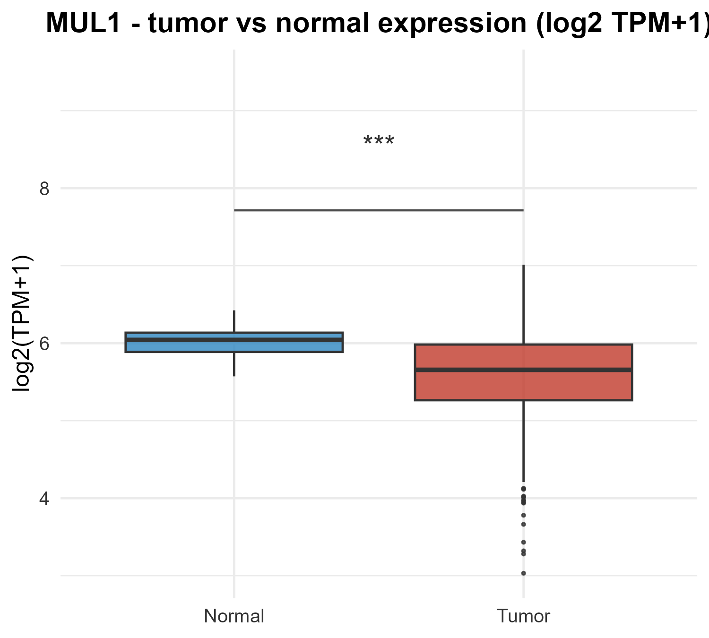

```r
# 6) diagnostic ROC curve (LUAD)
plot_roc_diag(luad, g)
```

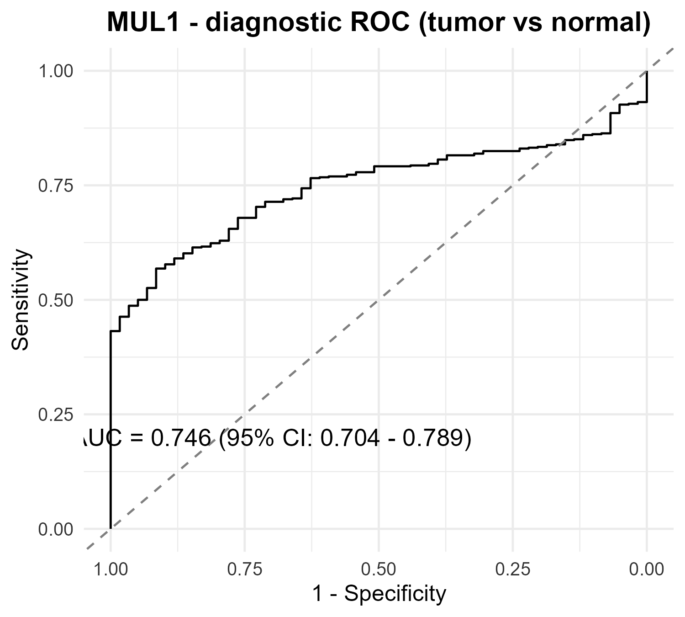

```r
# 7) KM survival by high/low expression (LUAD)
plot_km(luad, g)
```

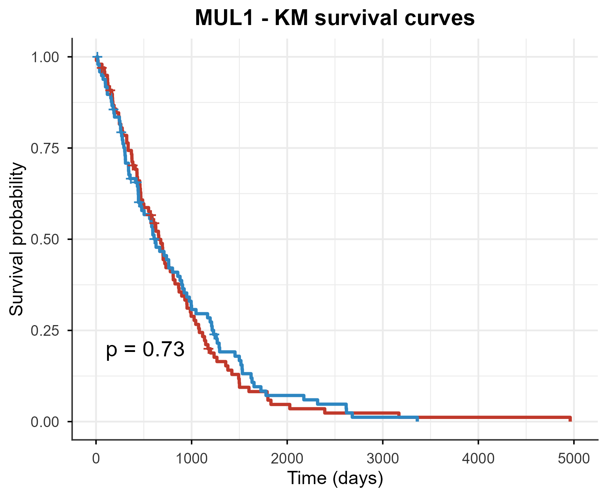

```r
# 8) UpSet: cancers with top Basic / Immune / Metabolic scores (threshold 0.5)
plot_upset_3dim(long[long$Gene == g, c("Cancer", "Basic_Score",
                                       "Immune_Score", "Metabolic_Score")],
                threshold = 0.5)
```

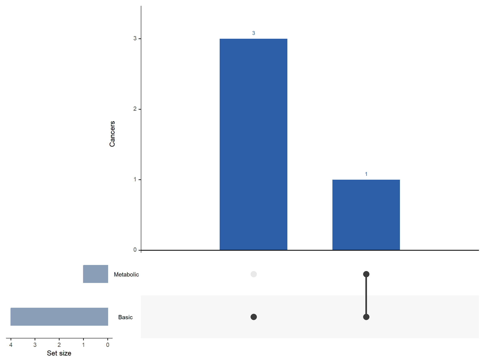

```r
# 9) automatic bilingual inference (English / Chinese)
gene_inference(luad, g, score_genes(luad, g), lang = "en")
gene_inference(luad, g, score_genes(luad, g), lang = "zh")
```

---
### Example 3 — custom gene set (with or without custom feature scores)

`score_genes()` / `score_genes_multi()` score **any gene set** found in the
pre-computed per-cancer gene universe (a curated ~1,500-gene background per
cancer). Genes outside the universe are skipped with a message. Non-ubiquitin
genes within the universe are annotated as the default `Other` ubiquitin tier
(0.6); the Basic / Immune / Metabolic dimensions are always computed. To drop
the ubiquitin tier for a custom gene set, restrict the selected dimensions.

```r
luad <- load_cancer_data("LUAD")

# (a) custom gene set WITHOUT custom scoring — any in-universe genes
my_genes <- c("EGFR", "TP53", "ERBB2", "MTOR", "STAT3")   # non-ubiquitin
r1 <- score_genes(luad, my_genes)
r1$scores[, c("Gene", "Ubi_Type", "Ubi_Score", "Basic_Score",
              "Immune_Score", "Metabolic_Score", "Combined_Score")]
# non-ubiquitin genes fall back to the "Other" tier (0.6); to exclude the
# ubiquitin dimension entirely, restrict the selected dimensions:
cp  <- default_combine_params()
cp$dimensions <- c("basic", "immune", "metabolic")
r1b <- score_genes(luad, my_genes, combine_params = cp)
```

```r
# (b) custom gene set WITH user feature scores (0-1):
#     a named numeric vector replaces the annotation-tier ubiquitin score
my_genes2 <- c("MUL1", "MDM2", "TRIM44")
my_scores <- c(MUL1 = 0.95, MDM2 = 0.80, TRIM44 = 0.70)
r2 <- score_genes(luad, my_genes2, feature_scores = my_scores)
r2$scores[, c("Gene", "Ubi_Type", "Ubi_Score", "Combined_Score")]
# Ubi_Type = "Feature": your own scores are used as the ubiquitin dimension

# pan-cancer version with the same custom scores
caches <- setNames(lapply(c("LUAD", "BRCA", "LIHC"), load_cancer_data),
                   c("LUAD", "BRCA", "LIHC"))
r3 <- score_genes_multi(caches, my_genes2, feature_scores = my_scores)
head(r3$summary)
```

> Custom gene sets can also be uploaded as a file in the Shiny app (tab ③:
> `.txt / .csv / .tsv / .xlsx`, first column genes, optional second column
> feature scores 0-1).

### Example 4 — custom single gene

Any single gene — ubiquitin-related or not — can be queried with the full
single-gene pipeline of Example 2. Here we use `EGFR` as a non-ubiquitin
custom gene:

```r
luad <- load_cancer_data("LUAD")
g    <- "EGFR"          # any custom gene, ubiquitin-related or not

s    <- score_genes(luad, g)
s$scores                # four-dimension scores for the single gene

# the same plot functions as Example 2 (NA dimensions are skipped):
sc   <- as.list(s$scores[, c("Ubi_Score", "Basic_Score",
                             "Immune_Score", "Metabolic_Score")])
sc   <- sc[!is.na(sc)]
plot_radar_fmsb(unlist(sc), gene = g)
plot_immune_cor(luad, g)        # bar chart of immune infiltration |r|
plot_metabolic_cor(luad, g)     # bar chart of metabolic pathway |r|
plot_expr_box(luad, g)          # tumor vs. normal expression
plot_roc_diag(luad, g)          # diagnostic ROC
plot_km(luad, g)                # KM survival
gene_inference(luad, g, s, lang = "en")   # automatic inference
```

> The same works for a custom single gene in the Shiny app (tab ④), with an
> optional feature score (0-1).

---


## Methods & parameter control

The scoring pipeline is:

```
user gene set
     │
     ▼
┌─────────┬──────────────┬───────────────────┬─────────────────────┐
│Ubiquitin│ Basic        │ Immune            │ Metabolic           │
│E1/E2/   │ expression   │ infiltration cor. │ 7 GSVA pathways     │
│E3/DUB/  │ diff. expr.  │ TIMER/CIBERSORT/  │ Amino_acid,         │
│UBD/ULD  │ Cox survival │ MCP/ssGSEA/xCell  │ Carbohydrate, Lipid,│
│tier     │ ROC (diag. + │ weighted |r|      │ Energy, Nucleotide, │
│         │ survival)    │                   │ TCA, Vitamin        │
└─────────┴──────────────┴───────────────────┴─────────────────────┘
     │            │              │                    │
     └────────────┴──────────────┴────────────────────┘
            dimension-weighted mean (default 1:1:1:1, adjustable)
                              │
                              ▼
       Combined_Score / Rank / Pct  →  ranking & visualization
```

- **Ubiquitin tier** — the gene is mapped to its functional tier
  (E1 / E2 / E3 / DUB / UBD / ULD / Other); non-ubiquitin genes receive
  `Other` and do not contribute to the ubiquitin score, while all other
  dimensions are computed normally.
- **Basic score** — normalized percentile combination of expression, |log2FC|
  of differential expression, univariate Cox *P*-value-derived score, and
  diagnostic/survival ROC AUC.
- **Immune score** — weighted mean of |Spearman r| between the gene and immune
  infiltration traits; the deconvolution method (default TIMER) can be changed,
  and relative weights across the five methods are tunable.
- **Metabolic score** — weighted mean of |Spearman r| with the seven GSVA
  pathway scores.
- **Missing data** — cancers without normal tissue re-normalize the basic score
  over available sub-items (flagged with `*`); LAML immune scores fall back to
  CIBERSORT.
- **Interpretation (automated, hypothesis only)** — a high Basic score suggests
  abundant expression with differential and/or prognostic association; a high
  Immune score points to immune-microenvironment involvement; a high Metabolic
  score suggests metabolic-reprogramming hypotheses. Prefer validating in the
  cancer type with the highest combined score.

---

## Function reference

Full documentation: `help(package = "UbiPanTriage")`.

### Data

| Function | Description |
| --- | --- |
| `available_cancers()` | List cancers with ready caches |
| `load_cancer_data(cancer)` | Load the pre-computed cache of one cancer |
| `check_extdata()` / `download_extdata()` | Check / download-install the pan-cancer data |
| `cancer_genes(cache)` | All genes in a cache |
| `gene_expression(cache, gene)` | log2(TPM+1) expression vector |
| `gene_expr_raw(cache, gene, unit)` | Raw expression (tpm / count / fpkm) |
| `gene_expr_log2(cache, gene, unit)` | log2-transformed expression |
| `immune_traits(cache)` / `metabolic_traits(cache)` | Immune / metabolic trait names |

### Scoring

| Function | Description |
| --- | --- |
| `annotate_genes(cache, genes)` | Ubiquitin tier annotation (E1/E2/E3/DUB/UBD/ULD/Other) |
| `calc_ubi_score()` | Ubiquitin functional-tier score |
| `calc_basic_score()` | Basic score (expression + diff. + survival + ROC) |
| `calc_immune_score()` | Immune-infiltration correlation score |
| `calc_metabolic_score()` | Metabolic-pathway correlation score |
| `score_genes(cache, genes, ...)` | Single-cancer four-dimension scoring |
| `score_genes_multi(caches, genes, ...)` | Multi-cancer scoring + pan-cancer ranks |
| `default_basic_params()` etc. | Default parameter sets (editable) |
| `check_dim_weights()` / `check_genes()` | Input validation helpers |

### Visualization

| Function | Description |
| --- | --- |
| `plot_radar` / `plot_radar_fmsb` | Four-dimension radar chart |
| `plot_immune_cor` / `plot_metabolic_cor` / `plot_cor_heatmap` | Correlation heatmaps |
| `plot_expr_compare` / `plot_expr_box` / `plot_expr_pancancer` | Expression plots |
| `plot_roc_diag` / `plot_km` | Diagnostic ROC / KM survival |
| `plot_ranking` / `plot_ranking_bar` / `plot_ranking_grid` | Ranking charts |
| `plot_score_heatmap` / `plot_facet_heatmap` | Score heatmaps |
| `plot_4d_dot` / `plot_3d_bubble` | Four-dimension dot / 3D bubble |
| `plot_upset_3dim` | UpSet diagram (cancers with top scores per dimension) |

### Inference & app

| Function | Description |
| --- | --- |
| `gene_inference(cache, gene, result, lang)` | Single-cancer automatic inference (en / zh) |
| `gene_inference_pancancer(caches, gene, result_multi, lang)` | Pan-cancer inference |
| `run_shiny_app()` | Launch the interactive web interface |

---

## Data & architecture

- **Source repository (main branch)** — R source, documentation, tests, Shiny
  app, and `data-raw/` build scripts (~200 MB).
- **Data repository (data branch)** — 33 `<CANCER>_cache.rds` files
  (whole-genome count / TPM / FPKM integer-encoded matrices + pre-computed
  sub-scores), `lookup/` (per-gene caches for ~39,000 genes), the pan-cancer
  table `pancancer_ubi_scores.rds`, and `plotcache/` (~4.2 GB in total),
  shipped as MD5-verified chunks and installed by `download_extdata()`.
- **Rebuilding caches** — `Rscript data-raw/build_pancancer_cache.R`
  (expression matrices), `Rscript data-raw/precompute_scores.R` (score tables),
  `Rscript data-raw/build_web_lookup.R` (per-gene lookup).
- **Extending to a new cancer type** — generate a `<CANCER>_cache.rds` with the
  same build pipeline and place it in `inst/extdata/`; code and interface
  recognize it automatically.

---

## Directory structure

```
UbiPanTriage/
├── R/                    # package functions (scoring, plotting, inference,
│                         # data download, launcher)
├── inst/
│   ├── extdata/          # 33 cancer caches + lookup (installed by download_extdata())
│   ├── extdata_manifest.csv   # data chunk manifest (MD5)
│   └── shiny/            # Shiny app (app.R, METHOD.md)
├── data-raw/             # cache build scripts (not installed)
├── man/                  # function documentation + README figures
├── vignettes/            # tutorials
└── tests/                # unit tests (scoring + UI regression)
```

---

## FAQ

**Q1. `available_cancers()` returns nothing?**
The data are not installed. Run `UbiPanTriage::download_extdata()` (requires
internet, ~4.2 GB).

**Q2. `download_extdata()` reports an unwritable `dest_dir`?**
The package was installed into a system library. Reinstall into a user library,
or pass a writable directory with `download_extdata(dest_dir = "...")`.

**Q3. My download was interrupted or fails with `404 Not Found`?**
Chunks are MD5-verified; re-running `download_extdata()` skips completed
chunks. A `404` or `Could not resolve hostname` means the `data` branch parts
are not reachable from your network (in mainland China,
`raw.githubusercontent.com` is frequently DNS-blocked or slow). Workarounds:
(1) retry — `download_extdata()` now falls back to mirror proxies
(gh-proxy / ghproxy.net / mirror.ghproxy) automatically; (2) force a mirror,
e.g. `download_extdata(mirror = "https://gh-proxy.com/https://raw.githubusercontent.com/WangYY-666/UbiPanTriage-R/data")`;
(3) install from a complete local `extdata` folder with
`download_extdata(local_dir = "...")`; (4) if the maintainer has published the
data parts as a GitHub Release, use `download_extdata(release = "data-v1")`.

**Q4. How can I analyze a single cancer without downloading all data?**
Build a cache structure with your own expression matrix and immune/metabolic
trait matrices (see `data-raw/build_luad_cache.R`), or call the low-level
functions (`calc_basic_score()` etc.) directly.

**Q5. Can I score non-ubiquitin genes?**
Yes. `score_genes()` computes Basic / Immune / Metabolic scores for any gene
set; the Ubiquitin dimension returns `Other` for non-ubiquitin genes and does
not affect the other dimensions.

**Q6. How does the R package differ from the web server?**
The web server (<http://129.211.3.138/>) is for quick, default-parameter
checks. The R package adds method selection, fine-grained weight tuning,
custom inputs, offline pre-computed data, and fully reproducible scripting.

---

## License

MIT. For research use only; please comply with the TCGA data-use policy.
