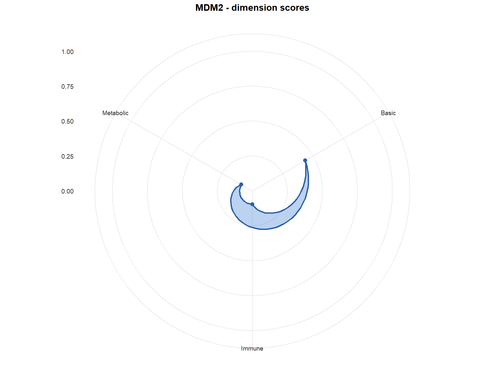
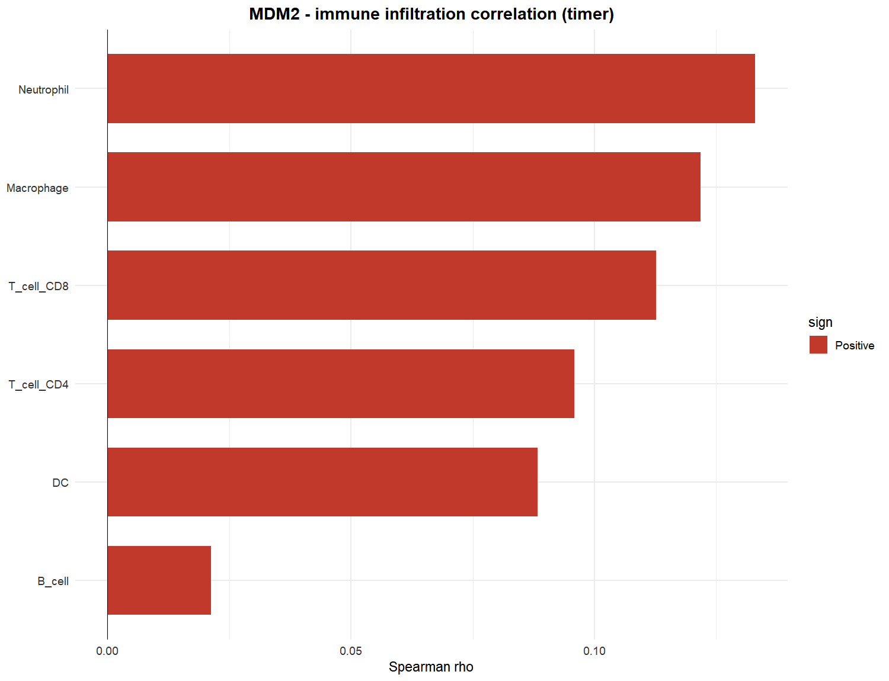
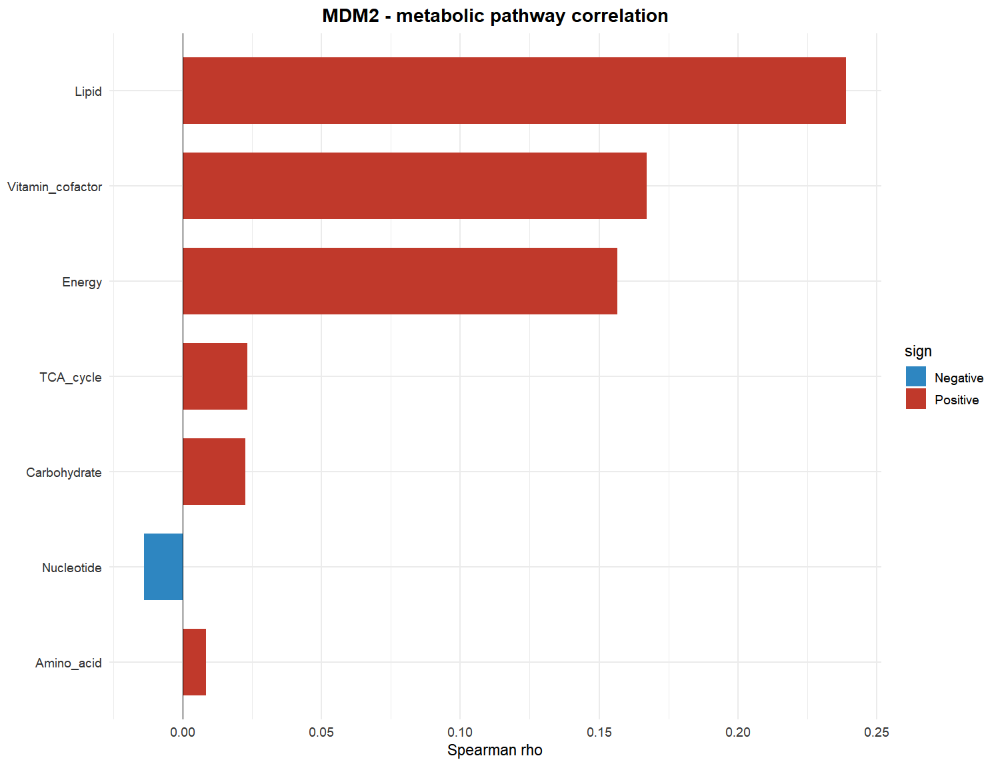
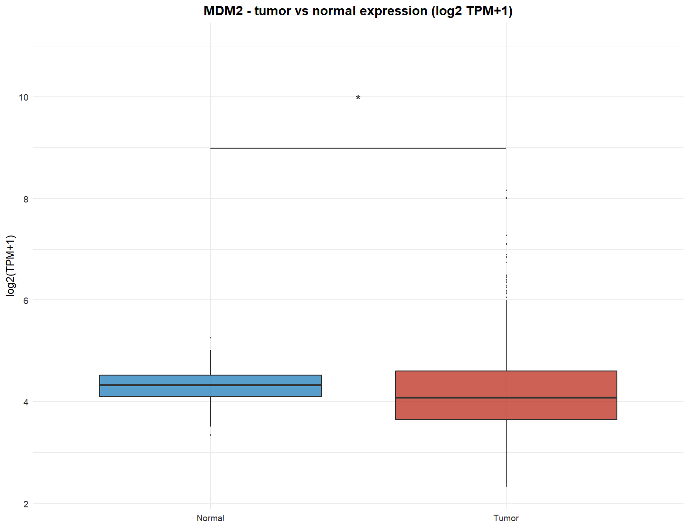
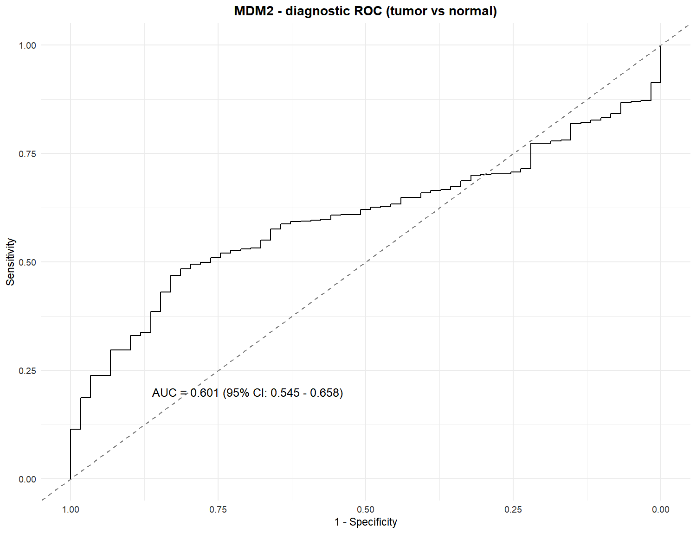
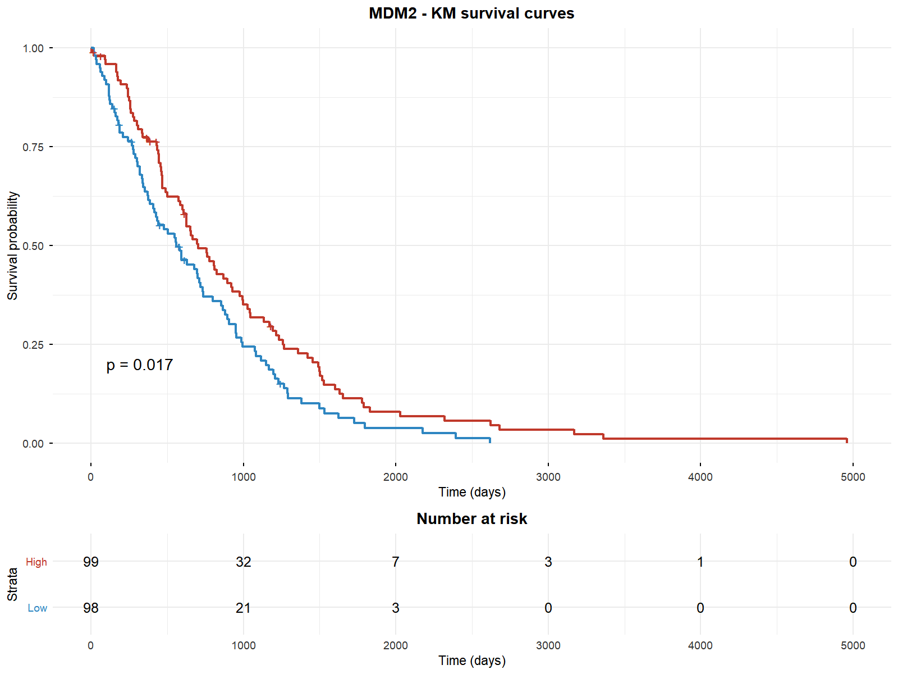
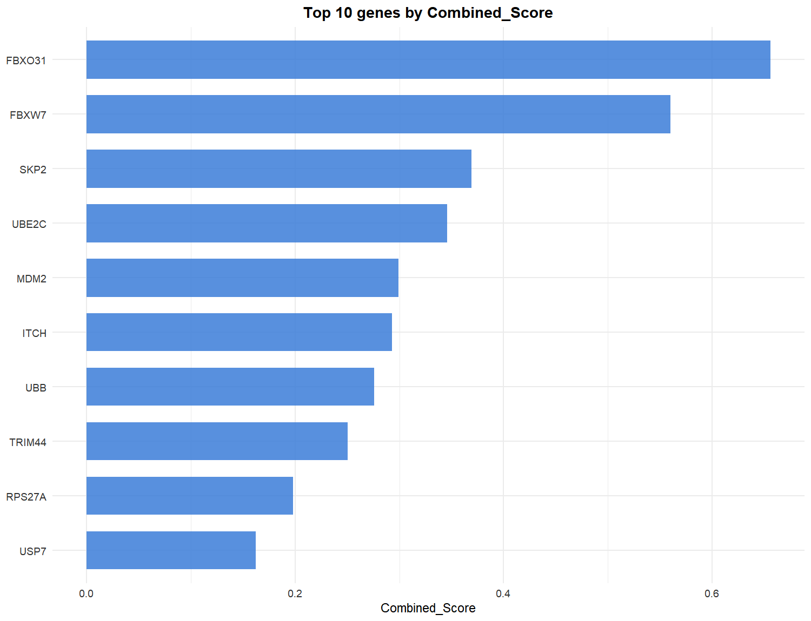
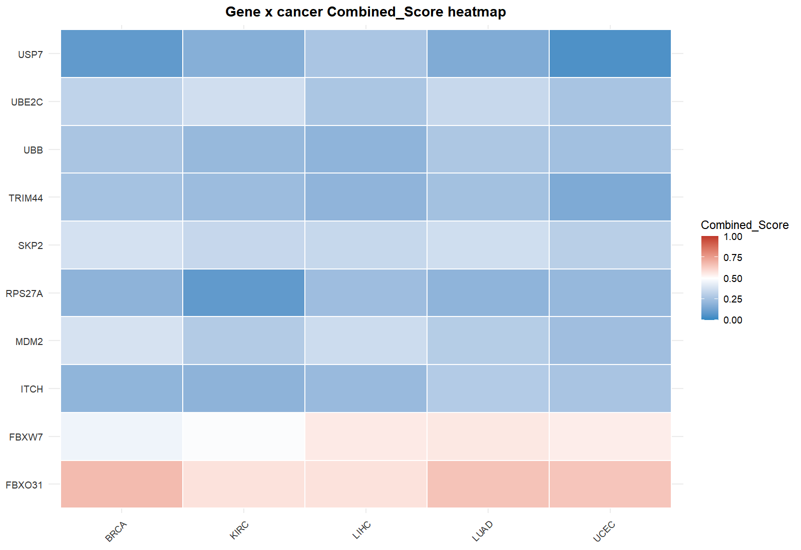
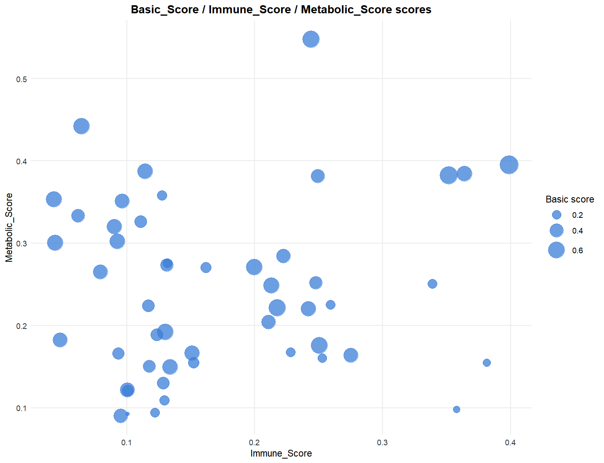

# UbiPanTriage

> Pan-cancer **Ubiquitin / Basic / Immune / Metabolic** four-dimension triage scoring for user-defined gene sets
> 泛癌泛素免疫代谢四维评分系统：对用户基因集在 TCGA 33 癌种中评分、排序、可视化，并给出可解释的研究方向推论

[](LICENSE)
[](https://www.r-project.org/)
[](https://shiny.posit.co/)

`UbiPanTriage` 基于 TCGA 33 癌种转录组，对泛素相关基因（或任意自定义基因集）计算四维评分：

- **泛素 Ubiquitin**：E1 / E2 / E3 / DUB / UBD / ULD 功能层级分
- **基础 Basic**：表达量 · 差异表达 · 单因素 Cox 生存 · ROC（诊断 + 生存）
- **免疫 Immune**：与免疫浸润的加权 |Spearman r|（TIMER / CIBERSORT / MCPcounter / ssGSEA / xCell）
- **代谢 Metabolic**：与 7 条 GSVA 代谢途径的加权 |Spearman r|

所有子项权重均可自定义；支持单癌种评分、跨癌种排序、交互式 Shiny 网页查询，
以及自动的中英双语保守推论（推论仅为计算假设，供实验选题参考）。

---

## 特性 Features

- **四维评分 + 全维度可调**：维度权重（0.1–1.0、一位小数、和为 1）、基础子项 / 免疫细胞 / 代谢途径相对权重均可修改；免疫浸润方法可切换；跨癌种汇总支持等权平均（默认）与按样本量加权
- **即时调用本地数据**：33 癌种全基因表达（count / TPM / FPKM）与全部子分预计算为本地缓存，查询无需重复跑 Cox / ROC / 相关性
- **交互式界面（Shiny，默认英文，右上角一键切换简体中文）**：
  - ① 泛素基因集评分排序：多基因 × 多癌种 → 四维评分气泡图 / 分面热图 / 四维排名条形图；评分表与详情（xlsx）可下载
  - ② 泛素单基因查询：雷达图 / 免疫相关热图 / 代谢相关热图 / 表达比较 / 肿瘤-正常箱线图 / 诊断 ROC / KM 生存曲线 / UpSet / 中英双语推论
  - ③ 自定义基因集（支持上传 .txt / .csv / .tsv / .xlsx 与可选特征分 0–1）
  - ④ 自定义单基因查询（同②全套图表，支持可选特征分维度）
  - ⑤ 使用说明（评分标准、权重规则、缺失数据处理、FAQ）
- **数据缺失兼容**：无正常组织/差异数据的癌种（ACC、DLBC、LAML、LGG、MESO、OV、TGCT、UCS、UVM）基础分在可用子项上重归一化并以 `*` 标注；LAML 免疫分自动回退 CIBERSORT
- **数据按需下载**：源码仓库保持轻量（约 200 MB），33 癌种预计算缓存（约 4.2 GB）由 `download_extdata()` 一次命令下载安装

---

## 安装 Installation

要求 R >= 4.1.0。

### 1. 安装 R 包

```r
# 推荐
install.packages("remotes")
remotes::install_github("WangYY-666/UbiPanTriage-R", upgrade = "never")

# 或使用 devtools
devtools::install_github("WangYY-666/UbiPanTriage-R", upgrade = "never")
```

### 2. 下载内置数据（一次即可，约 4.2 GB）

源码包不携带 33 癌种预计算缓存，安装后先运行：

```r
library(UbiPanTriage)
check_extdata()        # 检查数据是否就绪
download_extdata()     # 下载、校验（MD5）、拼接并安装到本地包目录
check_extdata()        # 应显示 33 个癌种就绪
```

> 数据分片存放在仓库的 `data` 分支，下载断点可续（分片逐一校验），重新运行会自动跳过已完成的分片。
> 若包安装在系统库导致无写权限，请改用用户库安装，或传 `dest_dir = "你的目录"` 自定义安装位置。

### 3. 启动交互界面（可选）

```r
run_shiny_app()        # 浏览器自动打开；端口被占用时自动切换随机端口
```

---

## 快速开始 Quick start

```r
library(UbiPanTriage)

# 查看可用癌种
available_cancers()                      # 33 个 TCGA 癌种

# 载入一个癌种的预计算缓存
luad <- load_cancer_data("LUAD")

# 单癌种评分：任意基因集（不必全是泛素基因）
genes <- c("MDM2", "TRIM44", "UBE2C", "FBXW7", "USP7")
res   <- score_genes(luad, genes)
head(res$scores[, c("Gene", "Ubi_Type", "Ubi_Score", "Basic_Score",
                    "Immune_Score", "Metabolic_Score",
                    "Combined_Score", "Combined_Rank")])

# 调整权重：加重生存权重，切换免疫方法，使用加权平均汇总
bp <- default_basic_params()
bp$weights <- c(expression = 1, diff = 1, survive = 2, roc = 1)
ip <- default_immune_params()
ip$method <- "cibersort"
cp <- default_combine_params()
cp$method <- "weighted"
res2 <- score_genes(luad, c("MDM2", "TRIM44"),
                    basic_params = bp, immune_params = ip, combine_params = cp)

# 多癌种跨癌种评分与排序
caches <- lapply(c("LUAD", "BRCA", "LIHC"), load_cancer_data)
res_multi <- score_genes_multi(setNames(caches, c("LUAD", "BRCA", "LIHC")), genes)
head(res_multi$summary)                  # 每个基因的泛癌汇总分与 Pan_Rank
```

---

## 示例与可视化 Examples & figures

以下示例在 LUAD 中演示单基因 `MDM2` 的全套可视化（与 Shiny ② 页相同）。

```r
# 1) 四维雷达图（用真实评分）
s <- res$scores[res$scores$Gene == "MDM2", ]
plot_radar(c(Basic = s$Basic_Score, Immune = s$Immune_Score,
             Metabolic = s$Metabolic_Score), gene = "MDM2")
```



```r
# 2) 免疫浸润相关热图（TIMER）
plot_immune_cor(luad, "MDM2")
```



```r
# 3) 代谢途径相关热图（GSVA）
plot_metabolic_cor(luad, "MDM2")
```



```r
# 4) 肿瘤 vs 正常表达箱线图（TPM）
plot_expr_box(luad, "MDM2")
```



```r
# 5) 诊断 ROC 曲线
plot_roc_diag(luad, "MDM2")
```



```r
# 6) KM 生存曲线（高/低表达分组）
plot_km(luad, "MDM2")
```



```r
# 7) 基因集综合评分排名
plot_ranking(res$scores, value = "Combined_Score")
```



```r
# 8) 跨癌种评分热图
plot_score_heatmap(res_multi$scores_long, value = "Combined_Score")
```



```r
# 9) 四维合一点图（基因 × 维度）
plot_4d_dot(res_multi$scores_long)
```


```r
# 10) 免疫 / 代谢 / 基础三维气泡图
plot_3d_bubble(res_multi$scores_long)
```



```r
# 11) 自动推论（中英双语）
gene_inference(luad, "MDM2", res, lang = "en")
gene_inference(luad, "MDM2", res, lang = "zh")
```

---

## 函数速查 Function reference

完整文档见 `help(package = "UbiPanTriage")`。

### 数据 Data

| 函数 | 说明 |
| --- | --- |
| `available_cancers()` | 列出已就绪的癌种 |
| `load_cancer_data(cancer)` | 载入某个癌种的预计算缓存 |
| `check_extdata()` / `download_extdata()` | 检查 / 下载安装内置泛癌数据 |
| `cancer_genes(cache)` | 缓存中的全部基因 |
| `gene_expression(cache, gene)` | 基因 log2(TPM+1) 表达向量 |
| `gene_expr_raw(cache, gene, unit)` | 基因原始表达（tpm / count / fpkm） |
| `gene_expr_log2(cache, gene, unit)` | 基因 log2 表达 |
| `immune_traits(cache)` / `metabolic_traits(cache)` | 免疫 / 代谢特征名 |

### 评分 Scoring

| 函数 | 说明 |
| --- | --- |
| `score_genes(cache, genes, ...)` | 单癌种四维评分（返回评分表 + 子项明细） |
| `score_genes_multi(caches, genes, ...)` | 跨癌种评分（返回长表 + 汇总 + 每癌种结果） |
| `calc_ubi_score(annotation, genes)` | 泛素功能层级分 |
| `calc_basic_score(cache, genes, params)` | 基础分（表达 / 差异 / 生存 / ROC） |
| `calc_immune_score(cache, genes, params)` | 免疫分（加权 |r|） |
| `calc_metabolic_score(cache, genes, params)` | 代谢分（加权 |r|） |
| `annotate_genes(cache, genes)` | 泛素基因注释（E1/E2/E3/DUB/UBD/ULD） |
| `check_genes(genes, universe)` | 基因名校验（返回找到 / 缺失） |
| `check_dim_weights(w)` | 维度权重合法性校验 |
| `immune_cor(cache, genes, method)` / `metabolic_cor(cache, genes)` | 相关性矩阵 |
| `rank_to_pct(x)` | 分数 → 0-1 百分位 |

### 参数默认值 Defaults

| 函数 | 说明 |
| --- | --- |
| `default_basic_params()` / `default_immune_params()` / `default_metabolic_params()` / `default_combine_params()` | 各维度与汇总默认参数 |
| `default_immune_weights(method)` / `default_metabolic_weights()` | 权重默认值（NULL = 组内等权） |

### 可视化 Visualization

| 函数 | 说明 |
| --- | --- |
| `plot_radar(values, gene)` / `plot_radar_fmsb(...)` | 四维雷达图 |
| `plot_immune_cor(cache, gene, method)` / `plot_metabolic_cor(cache, gene)` | 相关热图 |
| `plot_expr_box(cache, gene)` / `plot_expr_compare(cache, gene, unit)` | 表达箱线图 / 表达比较 |
| `plot_expr_pancancer(caches, gene)` | 跨癌种表达图 |
| `plot_roc_diag(cache, gene)` | 诊断 ROC |
| `plot_km(cache, gene)` | KM 生存曲线 |
| `plot_ranking(scores, value, top_n)` / `plot_ranking_bar(...)` / `plot_ranking_grid(...)` | 排名条形图 / 网格 |
| `plot_score_heatmap(scores_long)` / `plot_facet_heatmap(...)` | 评分热图 / 分面热图 |
| `plot_cor_heatmap(d)` | 自定义相关热图 |
| `plot_4d_dot(d)` / `plot_3d_bubble(d)` | 四维合一点图 / 三维气泡图 |
| `plot_alluvial(d)` / `plot_upset_3dim(d)` | 桑基图 / UpSet |

### 推论与界面 Inference & app

| 函数 | 说明 |
| --- | --- |
| `gene_inference(cache, gene, result, lang)` | 单癌种自动推论（en / zh） |
| `gene_inference_pancancer(caches, gene, result_multi, lang)` | 跨癌种自动推论 |
| `run_shiny_app()` | 启动交互式网页界面 |

---

## 评分原理 Scoring pipeline

```
用户基因集 (user gene set)
        │
        ▼
┌─────────┬─────────────┬───────────────────┬─────────────────────┐
│ 泛素    │ 基础 Basic  │ 免疫 Immune       │ 代谢 Metabolic      │
├─────────┼─────────────┼───────────────────┼─────────────────────┤
│ E1/E2/  │ 表达 FPKM   │ 免疫浸润相关      │ 7 代谢途径相关      │
│ E3/DUB/ │ 差异 DEG    │ TIMER/CIBERSORT/  │ GSVA (Amino_acid,   │
│ UBD/ULD │ 生存 Cox    │ MCP/ssGSEA/xCell  │ Carbohydrate, Lipid,│
│ 功能层级│ ROC(生存+   │ 加权|r|           │ Energy, Nucleotide, │
│         │   诊断)     │                   │ TCA, Vitamin)       │
└─────────┴─────────────┴───────────────────┴─────────────────────┘
        │              │                    │
        └──────────────┴────────────────────┘
         维度加权平均（默认等权 1:1:1:1，可调）
                        │
                        ▼
       Combined_Score / Rank / Pct → 排序与可视化
```

**推论逻辑（自动文本，仅为计算假设）**：基础分高 → 表达充分、有差异和/或预后关联，细胞行为学与成瘤实验更易成功；免疫分高 → 课题可向免疫微环境靠拢；代谢分高 → 可开展代谢重编程相关命题；推荐在综合分最高的癌种中优先验证。

---

## 数据与架构 Data & architecture

- **源码仓库（main 分支）**：R 源码、文档、测试、Shiny 界面、`data-raw/` 构建脚本，约 200 MB
- **数据（data 分支）**：33 个 `<CANCER>_cache.rds`（全基因 count/TPM/FPKM 整数编码矩阵 + 预计算子分）、`lookup/`（约 3.9 万基因的逐基因缓存，页面秒级出结果）、`pancancer_ubi_scores.rds`、`plotcache/`，共约 4.2 GB，分片压缩后由 `download_extdata()` 下载安装
- **重建缓存**：`Rscript data-raw/build_pancancer_cache.R`（全基因表达矩阵）、`Rscript data-raw/precompute_scores.R`（预计算表）、`Rscript data-raw/build_web_lookup.R`（逐基因 lookup）
- **扩展新癌种**：按等价构建流程生成 `<CANCER>_cache.rds` 放入 `inst/extdata/`，代码与界面自动识别

---

## 目录结构 Structure

```
UbiPanTriage/
├── R/                    # 包函数（评分、绘图、推论、数据下载、启动器）
├── inst/
│   ├── extdata/          # 33 癌种缓存 + lookup（由 download_extdata() 安装）
│   ├── extdata_manifest.csv  # 数据分片清单（MD5）
│   └── shiny/            # Shiny 界面 (app.R, METHOD.md)
├── data-raw/             # 缓存构建脚本（不随包安装）
├── man/                  # 函数文档
├── vignettes/            # 使用教程
└── tests/                # 单元测试（评分 + 界面回归）
```

---

## 常见问题 FAQ

**Q1：`available_cancers()` 返回空？** 数据未安装，运行 `UbiPanTriage::download_extdata()`（需联网，约 4.2 GB）。

**Q2：`download_extdata()` 提示 dest_dir 不可写？** 包被装进了系统库。重新用 `remotes::install_github(...)` 装到用户库，或给 `download_extdata(dest_dir = "...")` 传一个可写目录。

**Q3：下载中断了？** 分片按 MD5 校验，重新运行 `download_extdata()` 会自动跳过已下载完成的分片。

**Q4：如何只做单癌种分析，不下载全部数据？** 可用自己的表达矩阵 + 免疫/代谢特征矩阵构造 cache 结构（参考 `data-raw/build_luad_cache.R` 的字段），或直接使用 `calc_basic_score()` 等底层函数。

**Q5：评分能否用于非泛素基因？** 可以。`score_genes()` 对任意基因集计算基础/免疫/代谢三维评分；泛素维度对非泛素基因返回 `Other`（不参与泛素分），其余维度正常。

---

## 许可 License

MIT。仅供科研使用，请遵循 TCGA 数据使用政策。
